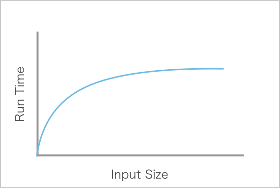

# Binary Search

Binary search is a powerful algorithm used to locate a specific element within a sorted array. It offers significant advantages over linear search, especially for large datasets, due to its efficient time complexity. This reading will guide you through building a binary search algorithm, understanding its time complexity, and exploring real-world applications.

## Learning Objectives

By the end of this lesson, you should be able to:

- Build a binary search algorithm.
- Identify the Big O of binary search and describe why it is so efficient.
- Identify situations where binary search can be applied to solve a problem.

---

## What is binary search?

The binary search algorithm works by splitting up a larger, sorted array into smaller subsections. Each time, the middle element of the array is checked to see if it matches the inputted value. If it does, that value is returned. If the value is not found, a new sub-array is created and the search continues.

For example, assume we have the following ordered array to search through and that we are searching for the number `53`:

```javascript
const numbers = [39, 45, 47, 53, 55, 63, 68, 71, 94, 95];
```

Binary search begins by identifying the value that is in the middle of the array. The `numbers` array above has 10 elements, which means that there are two elements in the middle of the array: `55` and `63`. We will choose to compare the lower number of `55` to our selected number, `53`, although choosing the higher number would not be a problem for our algorithm.

We compare `55` and our selected value (i.e., `53`) and see that they are not equal. Furthermore, we see that `55` is _greater than_ our selected value. This means that, if `53` is within the array, it must be at an index smaller than the index of `55`.

Our next search will be of a sub-array of the `numbers` array, where we exclude all numbers equal to and above `55`.

```javascript
// Sub-array of `numbers`
[39, 45, 47, 53];
```

We then repeat the process. We'll look to the middle and select the lower value of `45`. `45` is _less than_ `53`, which means we will slice our sub-array in a different direction.

```javascript
// Sub-array of the sub-array
[47, 53];
```

We once again repeat the process. This time, we compare `47` to `53`. They are not a match, so we shorten the sub-array even further.

```javascript
[53];
```

With only one value left, the middle of this array is our only option. In this case, the values do match, therefore we'd return the index of `53` in the _original array_, which is `3`. If the values did not match, there would be no more numbers to search, so we would return `-1` to represent that no matching value was found.

### Representation

The following image displays the process above.

|                                                                                              |
| ------------------------------------------------------------------------------------------------------------------------------------------------------- |
| Image credit: [Binary search algorithm via Virtual Labs](https://ds1-iiith.vlabs.ac.in/exp/unsorted-arrays/binary-search/binary-search-algorithm.html). |

### Building binary search

The code below is an implementation of binary search in JavaScript. Keep in mind that binary search is not JavaScript-specific; it can be written in any language.

```javascript
/*
  Searches through an ordered array of numbers to find a specific number. If found, the index of the number is returned. If not found, the value `-1` is returned.
  @param {string[]} numbers - An ordered array of integers
  @param {integer} val - A specific integer
*/
function binarySearch(numbers, val) {
  // Initialize start and end indexes to the beginning and end of the array, respectively.
  let start = 0;
  let end = numbers.length - 1;
  // Calculate the initial middle index.
  let middle = Math.floor((start + end) / 2);

  // Continue the search until the value is found or the start and end indexes cross each other.
  while (numbers[middle] !== val && start <= end) {
    // Select the element at the middle index.
    const selected = numbers[middle];
    if (val < selected) {
      // If the value is less than the selected element, update the end index.
      end = middle - 1;
    } else {
      // If the value is greater, update the start index.
      start = middle + 1;
    }
    // Recalculate the middle index for the narrowed sub-array.
    middle = Math.floor((start + end) / 2);
  }

  // Check if the value was found. If found, return its index; otherwise, return -1.
  return numbers[middle] === val ? middle : -1;
}
```

## Big O Evaluation

For the binary search algorithm, the Big O notation is O(log n), which is read as "logarithmic time." This means that the algorithm's performance grows at a rate proportional to the logarithm of the input size.

Binary search's time complexity is logarithmic because it repeatedly divides the search range in half with each comparison. In the worst case scenario, binary search needs to repeat this process until it either finds the target element or reduces the search space to a single element. This worst-case scenario is when the target element is not in the array, and it takes log₂(n) iterations to reach a single element. The base-2 logarithm represents the number of times the array can be divided by 2 until you reach a single element.

Binary search is highly efficient for large datasets. Even for enormous datasets, the number of comparisons required is relatively small because the search space is halved with each comparison.



## Use cases

Binary search is excellent for searching large datasets that are ordered. This could include large databases tables that are pre-ordered or even large text files.

Binary search does not have to just be used with numbers. It could, for example, iterate over an array of objects that are ordered by a certain key, or search through a list of alphabetized names. In order to do so, the code that compares the sought value to the middle value must be changed.


