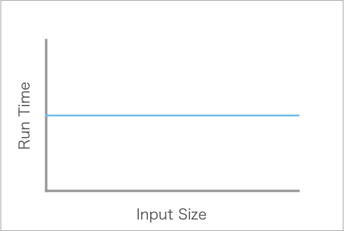
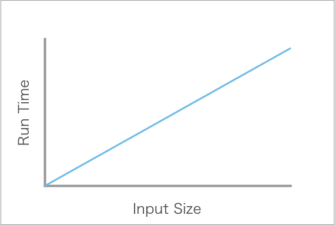
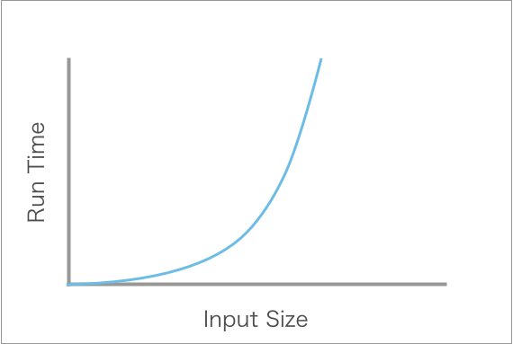
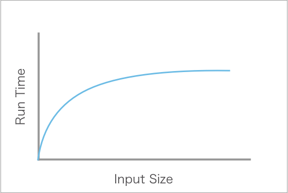
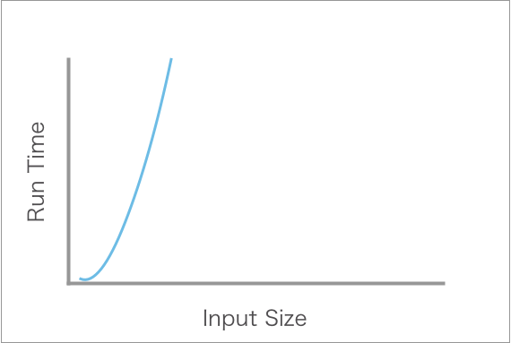

# Measuring Complexity

In this reading, we will dive deep into the world of algorithm analysis and complexity, a crucial aspect of programming that every coder must grasp. Understanding time and space complexity is critical to being able to evaluate the efficiency of your code and thereby improve it. By the end of this reading, you will be able to define, measure, and identify time and space complexities, and recognize them in common algorithms.

## Learning Objectives

By the end of this lesson, you should be able to:

- Describe how efficiency is measured in programming.
- Define time and space complexity and how it relates to programming.
- Evaluate and measure the time complexity of a program.

---

## Measuring efficiency

What does it mean to code well?

Up until this point, you have focused on writing code that solves a specific problem. Put another way, you have been focusing on the _correctness_ of code. And, as you've seen, there is often more than one way to develop code that is technically correct. Developing code that correctly implements a solution to a problem is the most important skill a software developer can have.

However, correctness is not the only way to measure someone's code. You may also measure someone's code as to whether or not it is understandable by others. For example, code that uses good indentation and proper naming conventions in addition to correctly solving a problem is better than correct code that is difficult to read. Clarity is also an essential skill for software developers.

You may also measure someone's code on efficiency. Efficiency is measured in terms of how fast code runs or how much memory it takes up. Code that is lightning fast and takes up very little space is deemed much better than code that is slow and requires a lot of space. These measurements are typically referred to as time and space complexity. To understand this best, consider how you might act if a website takes more than a few seconds to load. In today's fast-paced internet, you may find yourself getting frustrated or even navigating to a new website. Efficient code can be very important for some tasks.

In this course, it is most important to focus on code correctness and code clarity as opposed to efficiency. The assignments and projects you work on typically do not require you to worry too much about efficiency as today's computers are incredibly powerful. For example, a dataset of 1,000 elements may sound like a lot, but most computers today will quickly run code on such a dataset. However, as you transition to working as a software developer, you will need to be more and more conscious of how performant your code is.

### Big O Notation

Before we delve into time complexity, it's essential to understand the notation we use to describe them. Big O notation, often denoted as O(f(n)), is a mathematical way to express how the runtime or memory usage of an algorithm scales concerning the size of the input data.

- **O**: Stands for "order of," indicating the upper bound.
- **f(n)**: Represents a function of the input size (n).

Looking at the terms above, you may immediately feel some anxiety at seeing mathematical formulas. Despite the mathematical language, software developers are typically only concerned with understanding and communicating _the worst case scenario_ for an algorithm. That is, how long or how much space could an algorithm take? While some mathematical language may be used to communicate that idea, very little math actually needs to be done.

#### Worst case scenario example

How long does it take you to get ready in the morning?

In your head, you may have a general sense of how long it takes for you to make breakfast, brush your teeth, get dressed, and more. However, as you know if you've ever been late getting out of the door in the morning, sometimes the unexpected happens! Maybe you realize you hit snooze one too many times, or forgot to do laundry the day before and have to scramble to find clean clothes, or you've run out of milk for your breakfast cereal. While most of the time this doesn't happen, if you never want to be late you have to account for a little extra time in the morning to expect the unexpected.

Software developers think just like this. A software developer may think to themselves, "Sure, this function will _probably_ only work on an array with 1,000 elements... but there is that _one_ scenario where it may have 10,000." Understanding the worst case scenario isn't about being pessimistic and worrying about the most terrible scenario. Instead, it's about understanding the risks involved with a particular algorithm and attempting to mitigate some of the risks; or, at least, know that it could be a problem in the future.

## Time complexity

Time complexity is the most common ways to measure the efficiency of an algorithm. Time complexity refers to the amount of time an algorithm takes to complete its task. This measurement depends on an _algorithm's inputs_ as opposed to a specific metric of time.

While space complexity is also important, it is often less important to consider when working on web applications.

### Scenario

Imagine you are building an online web application that catalogs every song on the planet. The purpose of this website is to quickly be able to search up a song or artist by any relevant data point and get more information about it. The data for this website is stored in a data structure that is as follows:

```javascript
[
  //...
  {
    name: "Dolly Parton",
    albums: [
      {
        title: "Hello, I'm Dolly",
        songs: [
          { title: "Dumb Blonde", lengthInSeconds: 147 },
          { title: "Your Ole Handy Man", lengthInSeconds: 132 },
          { title: "I Don't Want to Throw Rice", lengthInSeconds: 145 },
          // ...
        ],
      },
      // ...
    ],
  },
  // ...
];
```

As you can see, this data structure is quite nested. With this data structure, there are a number of functions you could write that would get you interesting information. For example, you could write a function that:

- Returns all of the albums by a specific artist.
- Returns all stored artist names.
- Returns the last artist stored on the website.
- Returns every song that is shorter than two minutes.
- Returns every song by a specific artist.

It is possible to predict whether or not one of these functions will take longer than the others by measuring time complexity. And it is possible to measure whether or not one of these functions will take more space than others by measure space complexity. This information could then be used to prioritize certain features or change the user experience for users of the website.

### Time complexity

Take a look at the following function which always grabs the first element of an array in the same shape as the one above.

```javascript
function getFirstArtistName(data) {
  const artist = data[0];
  return artist.name;
}
```

When this function gets called, two operations occur:

1. A new variable is declared, `artist`, which access the first element of the array.
1. A key is accessed inside of the object stored within `artist`, which returns the value associated with the `name` key.

To determine the time complexity of this function, you must ask the following question: would the number of operations increase if the size of the input was different? Before continuing, it's important to break down the question above.

- "Number of operations" refers to the number of commands a computer will need to run to complete the algorithm. The more operations, the more time it will take to complete the algorithm.
- The "size of the input" refers to any data structure, but will most often refer to a collection such as an array or object. Often the "size of the input" refers to the length of an array or how many keys are within an object.

So what do you think? Would the number of operations, and thereby the amount of time it takes to complete, increase if the dataset increased in size? What if the dataset is only 10 elements? What if it's 1,000,000?

#### Constant time

The function above is said to have a time complexity of O(1), also referred to as _constant_. That's because, no matter how large the inputted data structure is, the number of operations needed to complete the function will always remain the same.

| Input Length | Approximate Number of Operations |
| ------------ | -------------------------------- |
| 0 (Empty)    | 1                                |
| 10           | 1                                |
| 100          | 1                                |
| 1,000        | 1                                |
| 10,000       | 1                                |

Functions that run on constant time are typically considered very performant. To be clear, we are talking about the number of operations _and not_ the number of seconds or milliseconds it takes for the function to run. Although these two units are often related, it is possible that the function could take longer on an older computer or due to other circumstances. Regardless, the function's operation count does not increase as the input increases. That's what makes this function a constant time function.



The graph above visually demonstrates what the table above shows. As the input size increases (i.e., the length of the inputted data array), the time it takes to run the program (i.e., the number of operations) remains the same.

### Linear time

Take a look at the function below which operates in linear time.

```javascript
function getAllArtistsNames(data) {
  const names = [];
  for (let artist of data) {
    names.push(artist.name);
  }
  return names;
}
```

How is this function different than the previous one? Consider the number of operations that will be run in this function. If the inputted data array includes ten elements, the loop inside of the function will run ten times.

| Input Length | Approximate Number of Operations |
| ------------ | -------------------------------- |
| 0 (Empty)    | 0                                |
| 10           | 10                               |
| 100          | 100                              |
| 1,000        | 1,000                            |
| 10,000       | 10,000                           |

This function is in linear time, also referred to as a time complexity of O(n). As the length of the array increases in size (i.e., as `n` gets larger), the number of operations increases at the same rate. Notice that the table above describes the _approximate_ number of operations. This function does have a couple of other operations, but at large numbers they do not affect the overall trend of the function.



As you can see in the graph above, as the input size increases the run time increases. Because this graph is a straight line, it is referred to as linear time complexity.

### Quadratic time

The function below is O(n²) time complexity, also referred to as quadratic or exponential.

```javascript
function getAllAlbumTitles(data) {
  const titles = [];
  for (let artist of data) {
    for (let album of artist.albums) {
      titles.push(album.title);
    }
  }
  return titles;
}
```

Assume that there are 10 elements in the data array, each of which have a key called `albums` which has 10 albums within it. This means that for every artist 10 iterations must be completed to access each of the album titles. If that happens 10 times for each artist, approximately 100 operations must occur before the function is complete.

| Input Length | Approximate Number of Operations |
| ------------ | -------------------------------- |
| 0 (Empty)    | 0                                |
| 10           | 100                              |
| 100          | 10,000                           |
| 1,000        | 1,000,000                        |
| 10,000       | 100,000,000                      |

As you can see, nested loops can lead to _many operations more_ than the inputted array length. Quadratic formulas are unavoidable at times, but are generally considered not very performant. When working on large data sets, software developers will take care to avoid using these kind of formulas if time is of the essence.



The graph above shows how increasing the input in a quadratic algorithm leads to increasing the run time. You should also notice that as the input grows larger, the curve gets steeper.

#### Reducing complexities

In the previous example, you may have wondered how the algorithm would be measured if each artist _did not_ contain an album array of the same size. It's unlikely that every artist in the data set would have the exact same number of albums.

Even though the measurement could be more complex, software developers focus on the worst-case scenario. For example, the worst-case scenario could be that there are 1,000 artists and each artist has 1,000 albums. Even if some of those artists don't have that many albums, it's better to lean towards the worst-case scenario as opposed to hope for the best.

However, every data set is different. In this case, you may know that no artist in your data set has more than 20 albums. If that were the case, you may say the complexity of the function could be written as O(n 𝗑 20), or O(20n). This would represent the fact that, in the worst-case scenario, the function would perform a number of operations equal to 20 times the length of the array.

Even this, however, can be reduced. When measuring the Big O of different algorithms, it is typical to reduce constant values to 1. This means that, as long as you can assure that there is a reasonable limit to the amount of albums per artist, the function above could even be considered O(n).

While this specific example can allow for such nuance, when measuring algorithms as part of interviews, it is best to rely on the very worst-case scenario. So, O(n²) is still an acceptable measurement for this function, as it assumes infinitely large inputs.

### Other common time complexities

The three time complexities above are some of the most common that you have already seen so far. There are two other complexities that are quite common although you may not have seen much of them.

- **Logarithmic** or **O(log(n))**: The logarithm of a function is the inverse to an exponent. Put another way, logarithmic algorithms actually level level off as the number of inputs increases, as you can see in the graph below. Logarithmic algorithms are considered to be excellent regarding efficiency, and is typically represented by binary search.

  

- **Factorial** or **O(n!)**: In mathematics, the factorial of a positive integer is the product of all positive integers leading up that integer. For example, the factorial of the number 5, represented as "5!", is equal to 1 times 2 times 3 times 4 times 5. Factorial algorithms can be found where every permutation of a set of data must be accessed. They are considered very inefficient.

  
